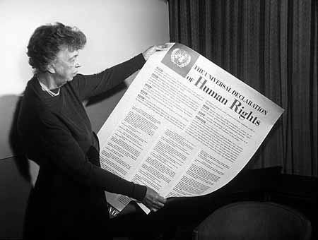

# Heading 1

All human beings are born free and equal in dignity and rights. All human beings are born free and equal in dignity and rights. All human beings are born free and equal in dignity and rights. All human beings are born free and equal in dignity and rights.

## Heading 2

All human beings are born free and equal in dignity and rights. All human beings are born free and equal in dignity and rights. All human beings are born free and equal in dignity and rights. All human beings are born free and equal in dignity and rights.

### Heading 3

All human beings are born free and equal in dignity and rights. All human beings are born free and equal in dignity and rights. All human beings are born free and equal in dignity and rights. All human beings are born free and equal in dignity and rights.

#### Heading 4

All human beings are born free and equal in dignity and rights. All human beings are born free and equal in dignity and rights. All human beings are born free and equal in dignity and rights. All human beings are born free and equal in dignity and rights.

## Bold

**All human beings are born free and equal in dignity and rights.** All human beings are born free and equal in dignity and rights.All human beings are born free and equal in dignity and rights.All human beings are born free and equal in dignity and rights.

## Italic

_All human beings are born free and equal in dignity and rights._ All human beings are born free and equal in dignity and rights.All human beings are born free and equal in dignity and rights.All human beings are born free and equal in dignity and rights.

## Bold and italic

**_All human beings are born free and equal in dignity and rights._** All human beings are born free and equal in dignity and rights.All human beings are born free and equal in dignity and rights.All human beings are born free and equal in dignity and rights.

## Struck through

~~All human beings are born free and equal in dignity and rights.~~ All human beings are born free and equal in dignity and rights.All human beings are born free and equal in dignity and rights.All human beings are born free and equal in dignity and rights.

## Numbered lists

1. All human beings are born free and equal in dignity and rights.
1. All human beings are born free and equal in dignity and rights.
1. All human beings are born free and equal in dignity and rights.
1. All human beings are born free and equal in dignity and rights.

All human beings are born free and equal in dignity and rights. All human beings are born free and equal in dignity and rights. All human beings are born free and equal in dignity and rights. All human beings are born free and equal in dignity and rights.

## Unnumbered lists

- All human beings are born free and equal in dignity and rights.
  - All human beings are born free and equal in dignity and rights.
- All human beings are born free and equal in dignity and rights.

All human beings are born free and equal in dignity and rights. All human beings are born free and equal in dignity and rights. All human beings are born free and equal in dignity and rights. All human beings are born free and equal in dignity and rights.

## Mixed lists

- All human beings are born free and equal in dignity and rights.
  1. All human beings are born free and equal in dignity and rights.
  2. All human beings are born free and equal in dignity and rights.
- All human beings are born free and equal in dignity and rights.

All human beings are born free and equal in dignity and rights. All human beings are born free and equal in dignity and rights. All human beings are born free and equal in dignity and rights. All human beings are born free and equal in dignity and rights.

## Figures and captions



All human beings are born free and equal in dignity and rights. All human beings are born free and equal in dignity and rights. All human beings are born free and equal in dignity and rights. All human beings are born free and equal in dignity and rights.

## Code

All human beings are born free and equal in dignity and rights. All human beings are born free and equal in dignity and rights. All human beings are born free and equal in dignity and rights. All human beings are born free and equal in dignity and rights.

```bash
ping wikipedia.org
```

All human beings are born free and equal in dignity and rights. All human beings are born free and equal in dignity and rights. All human beings are born free and equal in dignity and rights. All human beings are born free and equal in dignity and rights.

## URLs and email addresses

[wikipedia.org](https://www.wikipedia.org/), [info@wikipedia.org](mailto:info@wikipedia.org). All human beings are born free and equal in dignity and rights. All human beings are born free and equal in dignity and rights. All human beings are born free and equal in dignity and rights. All human beings are born free and equal in dignity and rights.

## Tables

| column 1                                                        | column 2                                                        |
| --------------------------------------------------------------- | --------------------------------------------------------------- |
| All human beings are born free and equal in dignity and rights. | All human beings are born free and equal in dignity and rights. |
| All human beings are born free and equal in dignity and rights. | All human beings are born free and equal in dignity and rights. |
| All human beings are born free and equal in dignity and rights. | All human beings are born free and equal in dignity and rights. |
| All human beings are born free and equal in dignity and rights. | All human beings are born free and equal in dignity and rights. |

: Table caption

All human beings are born free and equal in dignity and rights. All human beings are born free and equal in dignity and rights. All human beings are born free and equal in dignity and rights. All human beings are born free and equal in dignity and rights.

## Footnotes

All human beings are born free and equal in dignity and rights. All human beings are born free and equal in dignity and rights. All human beings are born free and equal in dignity and rights. All human beings are born free and equal in dignity and rights.^[All human beings are born free and equal in dignity and rights.]

## Quotes

::: {lang=de}

> Alle Menschen sind frei und gleich an Würde und Rechten geboren.

:::

All human beings are born free and equal in dignity and rights. All human beings are born free and equal in dignity and rights. All human beings are born free and equal in dignity and rights. All human beings are born free and equal in dignity and rights.

## Scientific citations

> All human beings are born free and equal in dignity and rights. They are endowed with reason and conscience and should act towards one another in a spirit of brotherhood. @unitednations1948

All human beings are born free and equal in dignity and rights. All human beings are born free and equal in dignity and rights. All human beings are born free and equal in dignity and rights. All human beings are born free and equal in dignity and rights.[@unitednations1948]

# Bibliography

::: {#refs}
:::
