# GitHub Markdown workflow

An archaic GitHub Markdown workflow for the Department of the History of Technology at ETH Zurich.

## Open a GitHub account

- Go to [GitHub](https://www.github.com), fill in your credentials and click `Sign up for GitHub`

- Click `Continue`

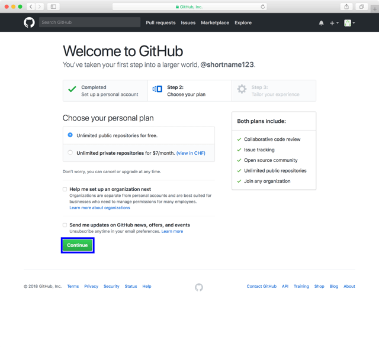

- Click `skip this step`

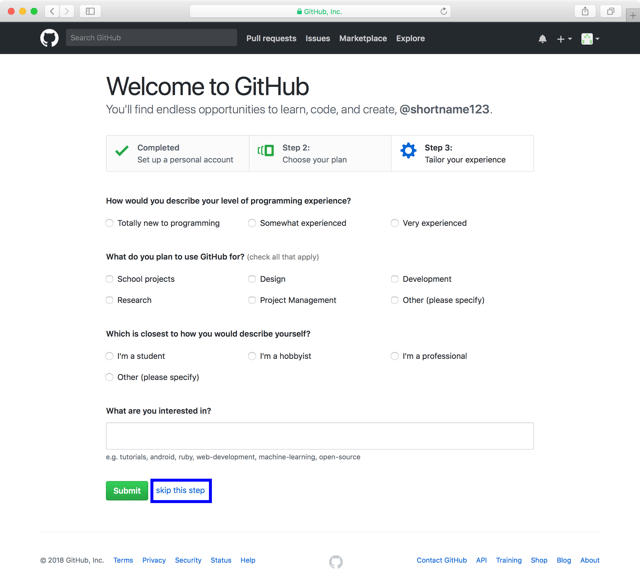

- Hit `Read the guide` and study some GitHub features

- Meanwhile you should have gotten a verification mail. Click on `Verify email address`

- Your account is now verified

## Create a new project

- Go to [GitHub](https://www.github.com) and click `Start a project`

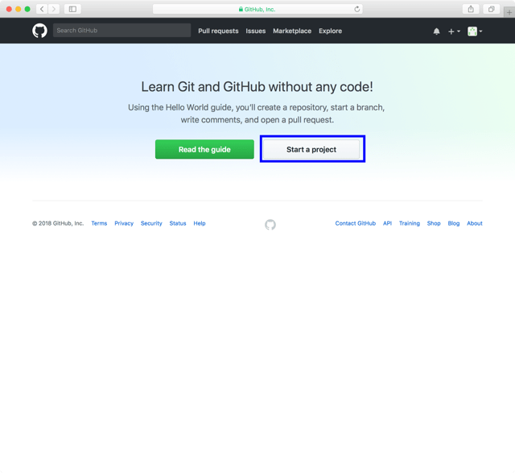

- Fill in a title, a description, click `Initialize this repository with a README` and click on `Create repository`

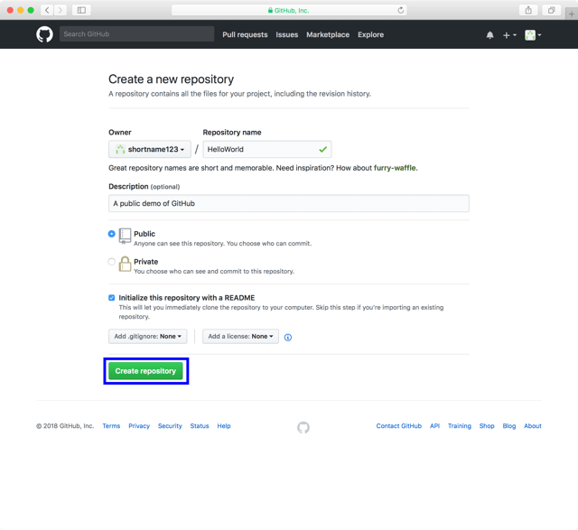

- Hint: If you want your project to be private you must subscribe to GitHub

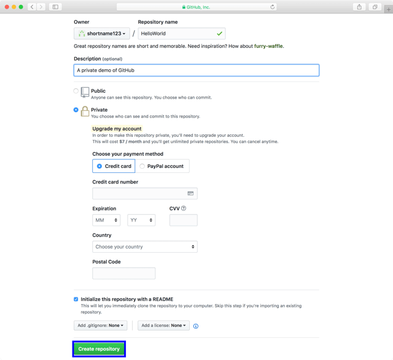

## Invite collaborators

- Go to [GitHub](https://www.github.com) and click `Your profile`

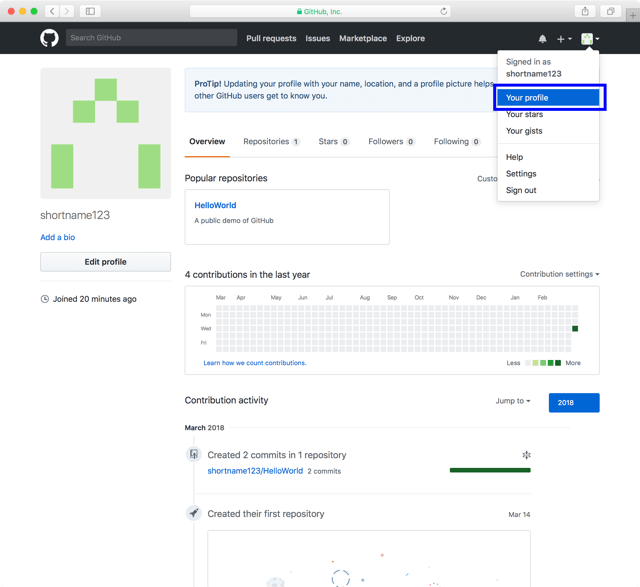

- Switch to `Repositories` and click on your project

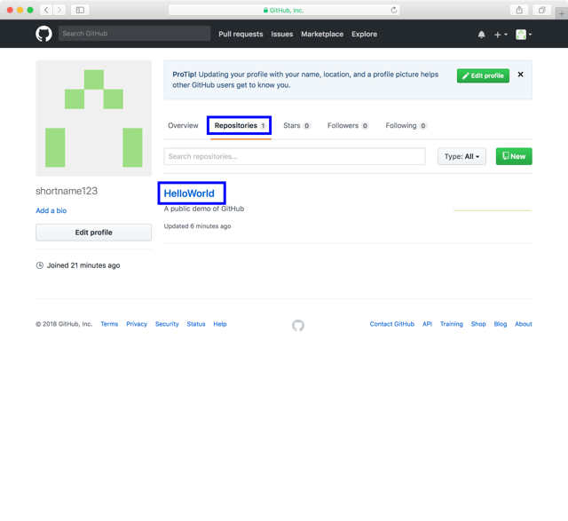

- Click on `Settings`

- Click on `Collaborators` and add them by email address or username

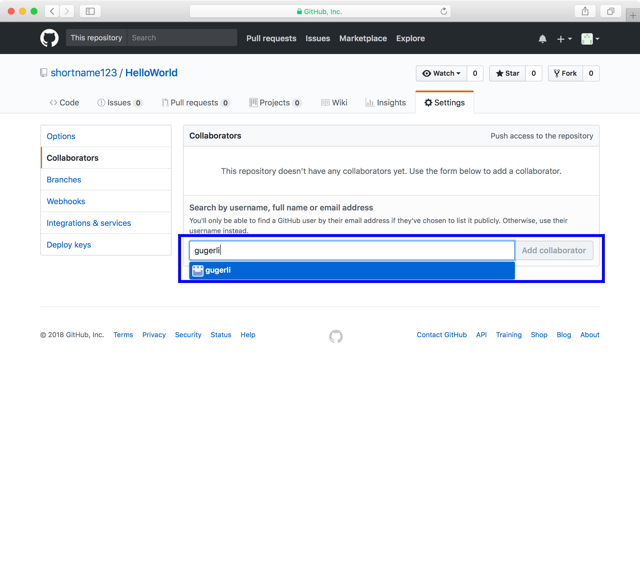

## Edit files online

- Go to [GitHub](https://www.github.com) and click `Your profile`

- Switch to `Repositories` and click on your project

- Click on `README.md`

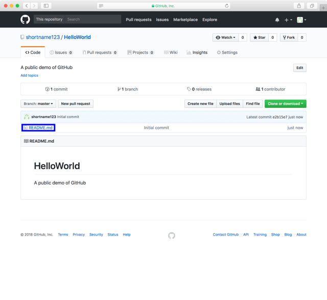

- Click on the pencil

- Edit your file according to the [Markdown Tutorial](./README_MARKDOWN.md) and click on `Preview changes`

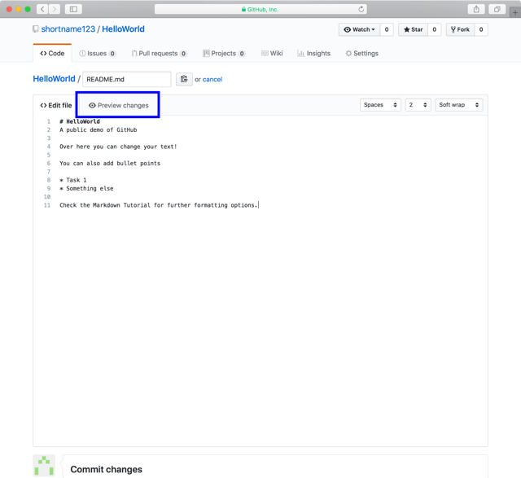

- You can switch back and forth to edit your file and preview the changes

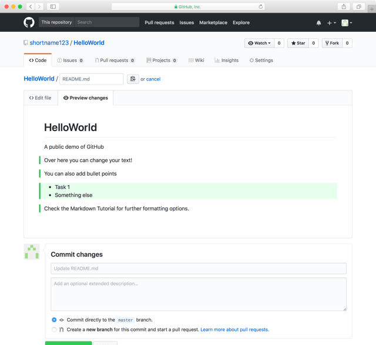

- Once you finish editing your file you need to describe your changes and click `commit changes`

## Edit files offline

### Install GitHub Desktop

- Go to [GitHub Desktop](https://dekstop.github.com), download and install the software

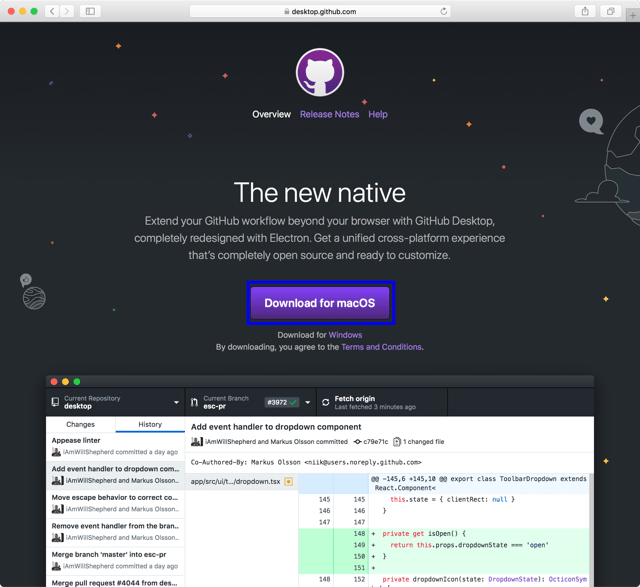

- Open GitHub Desktop by (double) clicking and click `Sign into GitHub.com`

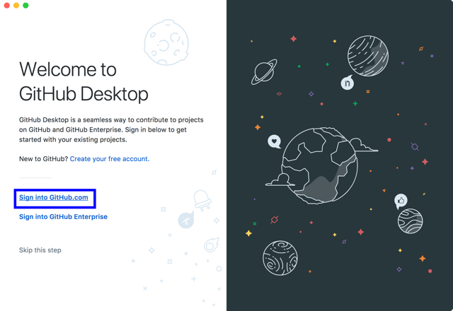

- Fill in your credentials and click `Sign in`

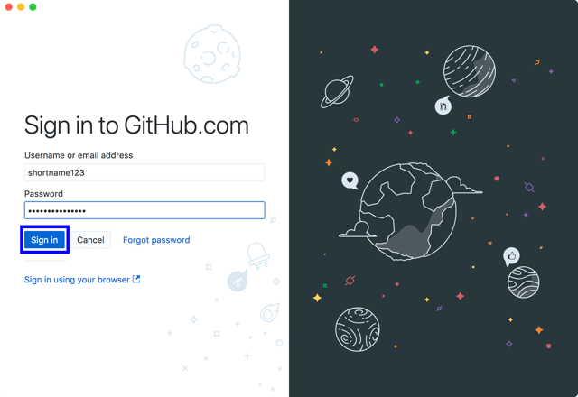

- Check your name and your email and click `continue`

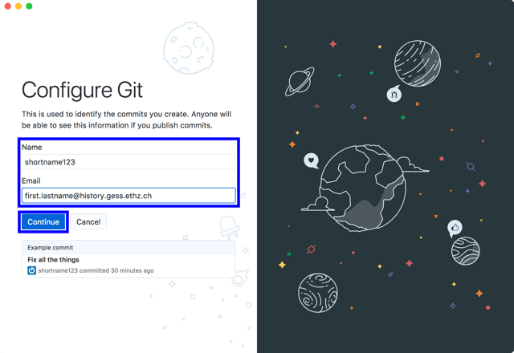

- Click `Finish`

### Make a local copy of your project (clone a repository)

Step Description Figure

- Click on `Clone a Repository`

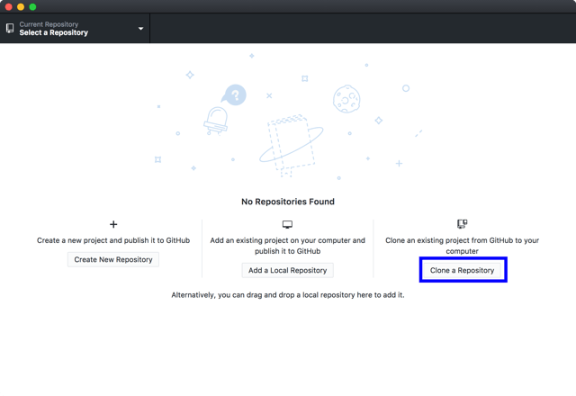

- If you already have another local repository you need to click on `File/Clone Repository`

- Choose a repository (private, public and accepted invitations are shown), choose a path to save it to and click `Clone`

### Edit your local copy and sync with cloud

- Click `Fetch origin` twice to download the latest changes from the cloud and click `open this repository`

- Open `README.md` or any other md-file with Editor or TextEdit

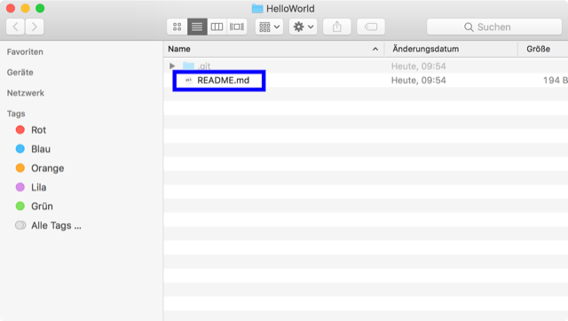

- Edit your file according to the [Markdown Tutorial](./README_MARKDOWN.md)

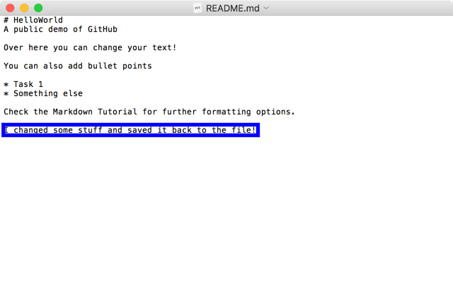

- Switch back to GitHub Desktop, describe your change and click `Commit to master`

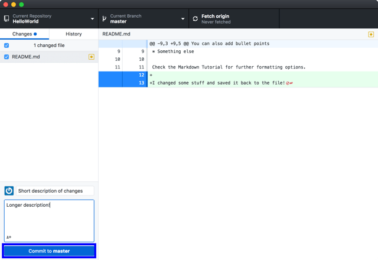

- Click on `Push origin` to sync your changes with the cloud

### Switch project

- Click on the arrow next to `Current repository` and switch between projects

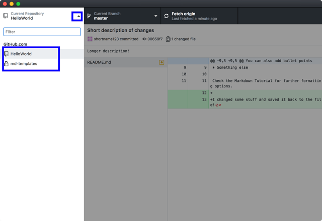

### Track changes

- Click on `History` to track all changes

[back](./)
